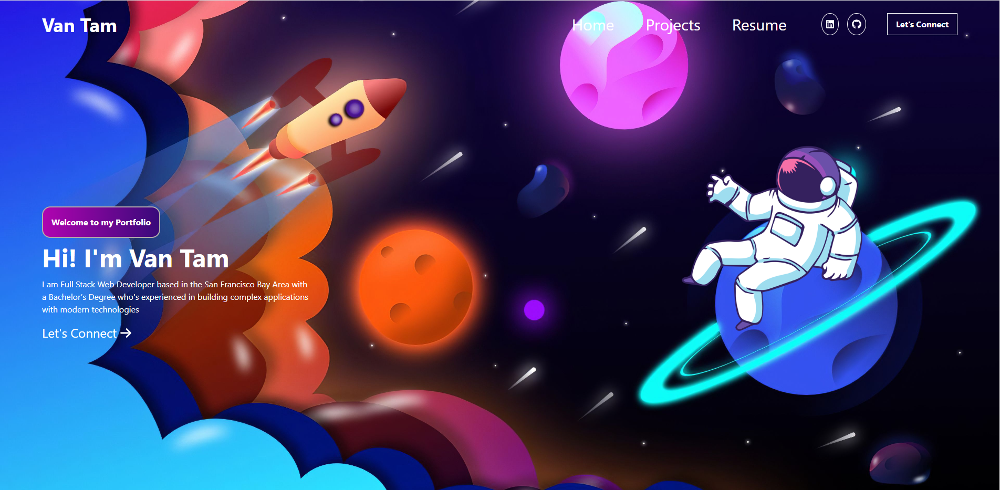

# Van Tam Portfolio

This project is a single-page application using React.js to dynamically render content to create a portfolio that includes "Contact me", "Resume", and "Projects" pages. Take a look at my work through my portfolio page and get to know me a little bit! Download my resume to view my work experience and where to find me.

## Table of Contents
- [Instructions](#instructions)
- [Usage Information](#usage-information)
- [Deploy Link](#deploy-link)
- [Built With](#built-with)
- [Question](#question)

## Instructions
- clone this repository.
- Download Node.js at [https://nodejs.org/en/download/](https://nodejs.org/en/download/)
- Using npm to install required node modules by using **npm install** in the command line.

## Usage Information
Run `npm run start` in the command line 

## Deploy Link
🚀The application has been deployed to Github and the URL of the deployed application is:
[https://vantam8300.github.io/react-portfolio/](https://vantam8300.github.io/react-portfolio/)

## Built With
- React
- Tailwind
- CSS
- HTML
- JavaScript

## Question
If you have any additional questions about this project, Feel free to reach me at [vantam8300@gmail.com](vantam8300@gmail.com).
For more of my project, please visit [https://github.com/vantam8300](https://github.com/vantam8300)